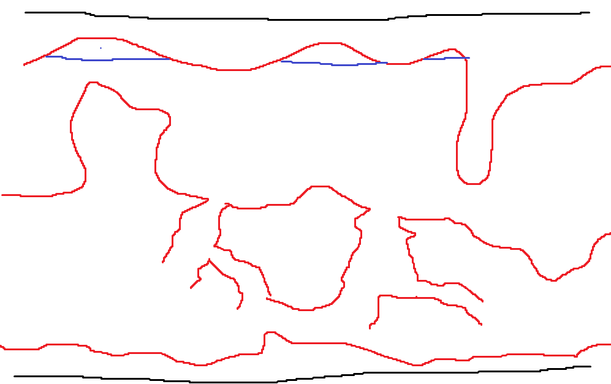

## General Mod Structure
* How do we get to the dimension?
    * Portals (multiblock or single block)
        * A portal that's underwater
        * Prismarine (or something related to the guardian temple)
        * Other ocean stuff like conduits or heart of the sea
    * Have it related to the underwater temple's gold blocks
        * 
        * You would have to go to this structure and either click on it or touch it
        * It should do something to indicate that it's an active portal, maybe give off particles

## The two layers of the dimension

(The open ocean area will have more space)

### Light Zone
* This area is brighter
    * It has sea lanterns
    * The player either has permanent night vision here, or maybe the water emits light

### Dark Zone
* This are is darker
    * The water may be a different block that mimics water, but is darker in color

## Things in the dimension

### New Blocks
* A block that is replaced by water after breaking
* Dimly natural blocks that spawn on the ocean floor and in ocean caves
* Custom blocks that the dimension's caves are made out of

### New Items
* Something to help you to breathe underwater
    * Something with conduits?
    * Scuba tanks
* Somthing for moving underwater
    * Add an easy method for players to get a trident (maybe with the swim fast enchantment)
    * If we aren't satisfied with the trident, we can work on adding our own item for movement
* Ranged weapon that works underwater (harpoon gun?)
    * Use new ore and jellyfish as string to make underwater bow
* New ore that creates armor and tool set
    * Works better underwater
    * Dimly glows
    * Blocks made from it can glow very bright

### New Mobs
* Kraken/Leviathan boss
    * How would it be spawned?
    * What would the reward for killing it be?
* Passive Fish (based on depth)
    * Crabs near hydrothermal vents
    * Blobfish
    * Generally whatever kind of friendly fish anyone wants to add

### World Generation Features
* Submarines in the ocean section
* Hydrothermal vents
* Large caves
* Trenches aka fat ravines?
* Underwater cities on ocean floor, should have really tall building that stick up so they are easy to find

### Effects
* A sickness from moving between ocean layers
    * Should be eliminated some way that is not too difficult
    * Can use this as an informal way to make sure that the player is ready
    * Once you get an item/armor set, you can move between the layers

### Sounds
* Random ambient ocean sounds when you're in the dimension